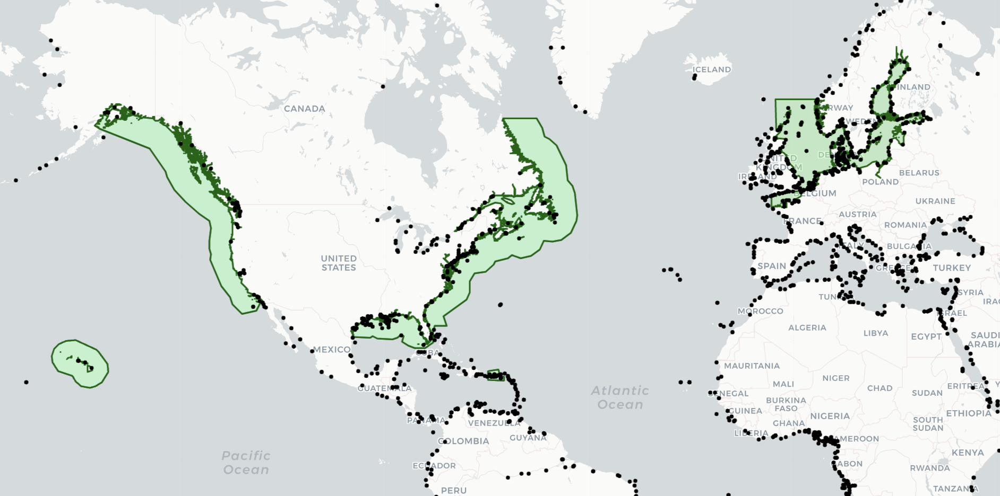

# Project Harrison World Ports Index

This repository contains a JSON dataset of 3,898 worldwide ports, including their latitude and longitude. The list was generated using **Pub 150**, various networking tools, and OpenAI's API.

This repository is under construction and there may be errors.



## Dataset Structure

The dataset provides the following details for each port:

- **CITY**: The city where the port is located.
- **STATE**: The state or region.
- **COUNTRY**: The country where the port is situated.
- **LATITUDE**: The latitude of the port.
- **LONGITUDE**: The longitude of the port.
- **OFFSET**: The port's UTC offset (e.g., -8 for PST, +1 for CET).
- **DST**: A boolean (`True` or `False`) indicating whether daylight savings time is currently in effect for the port.
- **Regulation_14**: A boolean (`True` or `False`) indicating whether the port falls within a MARPOL Annex VI Emission Control Area (ECA) for sulfur oxides (SOx) and particulate matter.
- **Regulation_13**: A boolean (`True` or `False`) indicating whether the port falls within a MARPOL Annex VI Nitrogen Oxide (NOx) Emission Control Area (ECA).

### MARPOL Annex VI: Regulation 13 & 14

MARPOL Annex VI establishes global limits on air pollution from ships. Two key regulations apply to Emission Control Areas (ECAs):

- **Regulation 14 (SOx and PM ECAs)**: Limits the sulfur content of marine fuel used in designated ECAs, reducing sulfur oxides (SOx) and particulate matter (PM) emissions. Ports inside these ECAs must comply with stricter fuel sulfur limits.
- **Regulation 13 (NOx ECAs)**: Regulates nitrogen oxides (NOx) emissions from marine diesel engines. Ports inside NOx ECAs require stricter compliance with Tier III NOx emission standards.

** Important:** Due that some port coordinates are on land a 50 nautical mile buffer is placed around the ECA areas. Therefore, ports near the ECA may be included in the Regulation_14
and Regulation_13 key:value pairs. 

### Example JSON Entries
```json
[
    {"CITY":"Aabenraa","STATE":"South Denmark","COUNTRY":"Denmark","LATITUDE":55.04,"LONGITUDE":9.42, "OFFSET": 1, "DST": False, "Regulation_14": True, "Regulation_13": False},
    {"CITY":"Laâyoune","STATE":"Western Sahara","COUNTRY":"Morocco","LATITUDE":27.07,"LONGITUDE":-13.47, "OFFSET": 0, "DST": False, "Regulation_14": False, "Regulation_13": False},
    {"CITY":"Aalborg","STATE":"North Jutland","COUNTRY":"Denmark","LATITUDE":57.05,"LONGITUDE":9.92, "OFFSET": 1, "DST": False, "Regulation_14": True, "Regulation_13": False}
]
```

## Example Usage: Finding a Port by City Name

The following Python example demonstrates how to search for a port by city name:

```python
import json

# Function to find a port by city name
def find_port_by_city(file_path, city_name):
    try:
        # Load the JSON data
        with open(file_path, 'r', encoding='utf-8') as file:
            data = json.load(file)

        # Find the port by city name
        for port in data:
            if port.get("CITY") == city_name:
                return port

        return None  # Return None if no match is found
    except Exception as e:
        print(f"An error occurred: {e}")

# Example usage
city_to_find = "Aalborg"
file_path = "/path/to/ports.json"  # Replace with the actual path to your JSON file
result = find_port_by_city(file_path, city_to_find)

if result:
    print(f"Port found: {result}")
else:
    print(f"No port found for city: {city_to_find}")
```

### Output Example
For the city `"Aalborg"`, the script outputs:
```plaintext
Port found: {'CITY': 'Aalborg', 'STATE': 'North Jutland', 'COUNTRY': 'Denmark', 'LATITUDE': 57.05, 'LONGITUDE': 9.92, 'OFFSET': 1, 'DST': False, 'Regulation_14': True, 'Regulation_13': False}
```

## There may be errors!

This dataset may contain errors! If you find an error, feel free to report it on the GitHub issues page.

## Use Cases

This dataset can be utilized in various domains, for example:

- **Time Calculations**: Determining the local time at a port based on UTC offset.
- **Routing**: Developing maritime and logistic routes.
- **ETA Predictions**: For use with time of arrival calculations.
- **Emission Compliance**: Identifying ports within MARPOL Annex VI ECAs for compliance purposes.

## Contribution

We welcome contributions and suggestions to improve the dataset. Feel free to:

- Submit issues or enhancements via the [GitHub Issues page](#).
- Fork the repository and submit pull requests with updates or new data.
